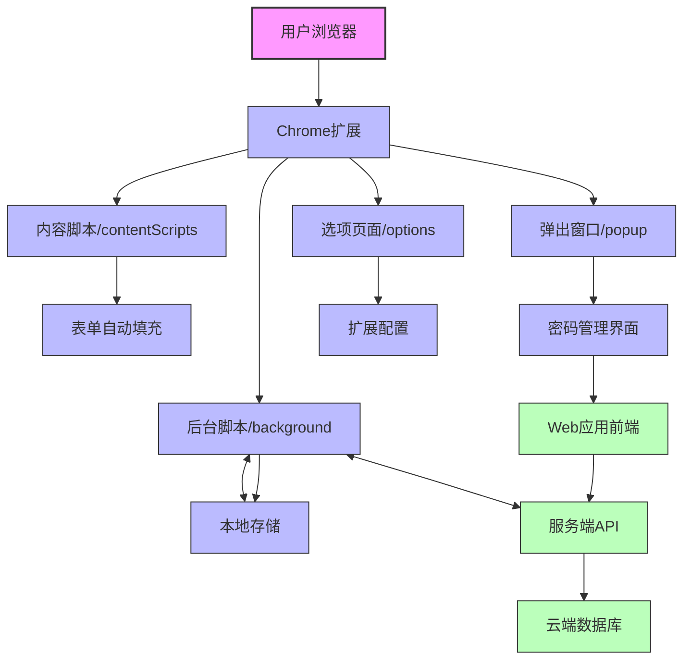
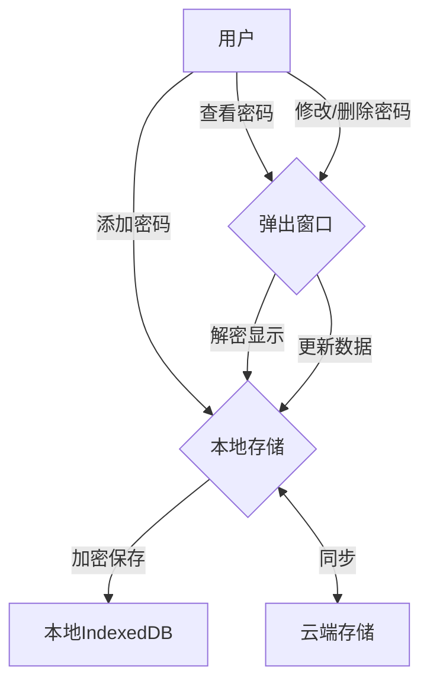
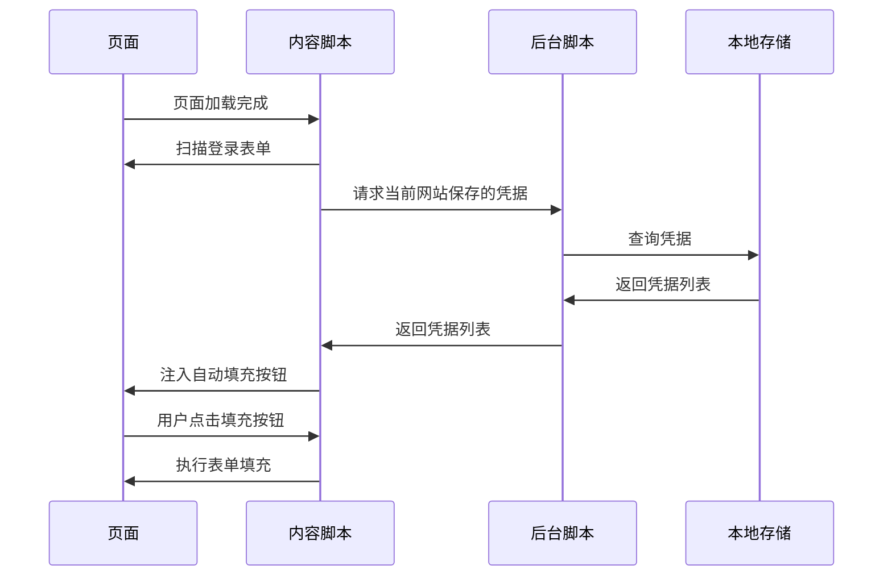

正在收集工作区信息# UTools UPassword 项目启动和打包文档

## 目录

- 项目介绍
- 项目架构
- 项目结构
- 开发环境配置
- 开发流程
- 构建与打包
- 浏览器安装
- 功能说明
- 项目截图
- 技术栈
- 版本更新日志
- 贡献指南
- 常见问题

## 项目介绍

UTools UPassword 是一款现代化的密码管理Chrome扩展，帮助用户安全地存储、管理和自动填充网站登录凭据。该扩展提供密码生成、密码自动填充、云端同步等功能，保障用户网络账号安全。

## 项目架构

下图展示了 UTools UPassword 项目的整体架构和数据流：



## 项目结构

```
utools-upassword/
├── webext/             # 浏览器扩展代码
│   ├── src/
│   │   ├── background/    # 后台脚本
│   │   ├── contentScripts/# 内容脚本(自动填充等功能)
│   │   ├── popup/         # 弹出窗口界面
│   │   └── options/       # 选项页面
│   ├── extension/         # 构建输出目录
│   └── package.json       # 扩展端依赖配置
├── web/                   # 配套Web应用
│   ├── src/
│   │   ├── api/           # 接口调用
│   │   ├── views/         # 页面组件
│   │   └── components/    # 通用组件
│   └── package.json       # Web端依赖配置
└── server/              # 后端服务
    ├── src/
    │   ├── modules/      # 业务模块
    │   ├── auth/         # 认证相关
    │   └── app.module.ts # 主模块
    └── package.json      # 服务端依赖配置
```

## 开发环境配置

### 前置要求

- Node.js 16.x 或更高版本
- pnpm 7.x 或更高版本
- Chrome/Edge 浏览器 (开发测试用)

### 安装依赖

```bash
# 安装扩展端依赖
cd webext
pnpm install

# 安装Web端依赖
cd ../web
pnpm install

# 安装服务端依赖
cd ../server
pnpm install
```

## 开发流程

### 扩展端开发

```bash
# 进入扩展目录
cd webext

# 启动开发服务 (Chrome)
pnpm dev

# 或启动Firefox版本开发服务
pnpm dev-firefox
```

启动后，扩展文件会生成在 `extension/` 目录中，可通过浏览器的开发者模式加载。

### Web应用开发

```bash
# 进入Web应用目录
cd web

# 启动开发服务器
pnpm dev
```

Web应用默认运行在 `http://localhost:3000`

### 服务端开发

```bash
# 进入服务端目录
cd server

# 启动开发服务器
pnpm start:dev
```

服务端默认运行在 `http://localhost:3001`

### 常用开发命令

```bash
# 清理构建文件
pnpm clear

# 类型检查
pnpm typecheck

# 代码格式检查
pnpm lint

# 运行测试
pnpm test
```

## 构建与打包

### 构建扩展

```bash
cd webext

# 完整构建流程
pnpm build
```

该命令会依次执行：
1. 清理旧的构建文件
2. 构建Web界面部分
3. 准备文件结构
4. 构建background脚本
5. 构建content scripts

### 打包扩展

```bash
# 打包为zip文件(用于Chrome应用商店上传)
pnpm pack:zip

# 打包为crx文件(用于直接安装)
pnpm pack:crx

# 打包为Firefox扩展格式
pnpm pack:xpi
```

打包后的文件将生成在项目根目录：
- `extension.zip` - 用于上传到Chrome Web Store
- `extension.crx` - 可直接拖放到Chrome安装
- `extension.xpi` - 适用于Firefox

### 构建Web应用

```bash
cd web
pnpm build
```

构建后的文件会生成在 `web/dist/` 目录，可部署到任何静态文件服务器。

### 构建服务端

```bash
cd server
pnpm build
```

构建后的文件会生成在 dist 目录，可部署到服务器运行。

## 浏览器安装

### 开发版安装

1. 在Chrome中打开 `chrome://extensions/`
2. 打开右上角的"开发者模式"
3. 点击"加载已解压的扩展程序"
4. 选择 extension 目录

### 正式版安装

方式一：通过Chrome网上应用店安装（推荐）
- 发布后可通过Chrome Web Store搜索安装

方式二：拖拽安装crx文件
1. 构建并打包扩展 `pnpm build && pnpm pack:crx`
2. 打开Chrome的扩展管理页面 `chrome://extensions/`
3. 将生成的 `extension.crx` 文件拖入浏览器窗口
4. 确认安装

## 功能说明

### 密码存储与管理



### 自动填充功能

扩展会自动检测页面上的登录表单，并提供以下功能：

1. 自动识别用户名和密码输入框
2. 根据当前网站URL匹配已保存的账号
3. 在用户名输入框旁显示自动填充按钮
4. 单账号时点击直接填充，多账号时显示选择菜单
5. 支持动态加载的表单和单页应用



### 密码同步功能

通过内置的iframe桥接实现与Web应用的数据同步：

1. 从本地存储读取密码记录
2. 发送到Web服务进行比对和合并
3. 实时显示同步进度
4. 支持新增和更新记录

## 项目截图

### 弹出窗口界面

!弹出窗口界面

*弹出窗口提供快速访问密码库、添加新密码和搜索功能*

### 密码管理页面

!密码管理页面

*密码管理页面支持分类查看、搜索、编辑和删除密码*

### 自动填充功能

!自动填充功能

*自动填充功能检测登录表单并提供便捷的账户选择*

### 安全设置页面

!安全设置页面

*安全设置页面允许用户自定义加密设置和同步选项*

## 技术栈

本项目使用以下技术栈：

- **浏览器扩展部分**：
  - TypeScript：主要编程语言
  - Vue 3：UI框架
  - Vite：构建工具
  - UnoCSS：原子化CSS框架
  - IndexedDB：本地存储
  - Web Crypto API：加密功能
  - Playwright：端到端测试

- **Web应用部分**：
  - Vue 3：UI框架 
  - Vite：构建工具
  - Pinia：状态管理
  - Vue Router：路由管理

- **服务端部分**：
  - NestJS：后端框架
  - TypeORM：数据库ORM
  - PostgreSQL：关系型数据库
  - JWT：认证机制
  - Redis：缓存

## 版本更新日志

### v1.0.0 (2023-10-01)
- 初始版本发布
- 支持基本的密码存储和自动填充功能
- 支持与Web应用同步

### v1.1.0 (2023-11-15)
- 添加密码健康检查功能
- 优化自动填充算法
- 修复多个已知问题

### v1.2.0 (2023-12-20)
- 添加多语言支持
- 改进用户界面
- 提升同步性能
- 增加更多密码模板

## 贡献指南

我们欢迎开发者参与贡献！如果您想为项目提交代码，请遵循以下步骤：

1. Fork 本仓库
2. 创建您的特性分支 (`git checkout -b feature/amazing-feature`)
3. 提交您的更改 (`git commit -m 'Add some amazing feature'`)
4. 推送到分支 (`git push origin feature/amazing-feature`)
5. 打开一个 Pull Request

请确保您的代码符合我们的编码规范，并通过了所有测试。

## 常见问题

**Q: 扩展无法正常加载怎么办？**  
A: 检查 `extension` 目录是否完整，尝试重新执行 `pnpm build`，然后重新加载扩展。

**Q: 自动填充按钮没有显示？**  
A: 可能是页面结构复杂或使用了特殊框架，尝试在控制台查看是否有相关错误信息。

**Q: 密码同步失败？**  
A: 检查网络连接和Web服务是否正常运行，确认是否已登录Web应用。

**Q: 如何升级扩展版本？**  
A: 修改 `manifest.json` 中的版本号，执行构建和打包命令，然后重新上传或安装。

**Q: 如何备份密码数据？**  
A: 在设置页面中，使用"导出数据"功能将加密的密码数据导出为文件保存。

**Q: 密码在设备间如何同步？**  
A: 登录同一个账号后，扩展会自动与云端同步您的密码数据，确保多设备间的数据一致。

---

📝 **注意**：本文档适用于UTools UPassword项目的开发和构建流程，具体功能可能会随版本更新而变化。